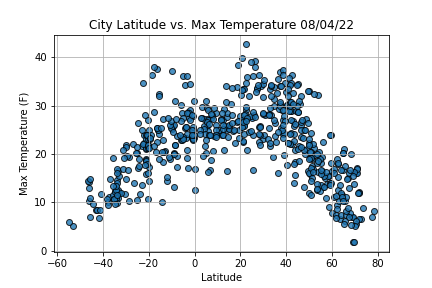

# WheaterPy

#### Objective 
For this analysis we made 2 different projects, the first one was to see the difference between some climate variables vs latitude, in particular to see the difference
between the north hemisphere and the south hemisphere, the second one was to learn how to use API and make maps out of the information that we can obtain troguh them.

### Results
For the first analysis the north hemisphere had a little more maximum temperature than the south but they had the same tendency where the equator had the highest
temperature and the poles where colder as expected 

for the other images there was not a pattern to be seen so if your interested in watching them they are in the weather_data folder.

Now for the second activity we were able to discover how to get information about different type of "luxuries" or accomodations in the cities that you may want to
travel, we used the information from the first activity to select the cities that where in a temperature range that the user desire and see the closest hotel and
restaurant that the city had to offer
